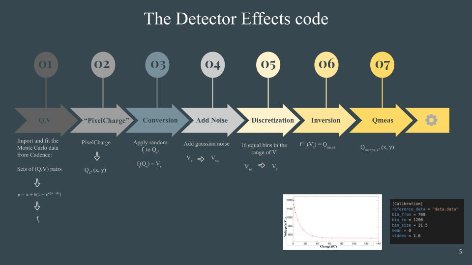

# **Allpix Squared Simulation for the FASER pre-shower detector**

All the information of how to download allpix in lxplus or locally are in the [official git repository](https://gitlab.cern.ch/allpix-squared/allpix-squared) of Allpix.

You can find the allpix branch (with the implementation of hexagonal pixels and the detector effects) of the simulation [here](https://gitlab.cern.ch/rkotitsa/allpix-squared/-/tree/calibration_genie). Some of the changes should be merged in the main repository long term.

## **Description**

This is a simulation which implements the geometry of the FASER pre-shower detector. It is the full implementation of ASICS and the hexagonal pixels of the planes of the detector. Except from the hexagonal geometry of the pixels, there is also implementation of the Detector Effects. Three specific modules were built to implement these effects inside the geometry of the preshower for further studies and for the generation realistic simulation data to feed the recostrunction algorithms. Everything is written in C++17.

### **The additions in Allpix, which are implemented specifically for the needs detector effects and the preshower detector.**

**The modules:**

`[Calibration]`:
In this module we implement the detector effects of our simulation.
In this module we have to have in our "workspace", a file `*.data`, in which we import the data from the program Cadence. 
The `*.data` file has to have the following format:  
In the first line of the file has to be a set of 2 numbers, which describes the file.
i.e. `7 6`. This shows us that there will be 7 datasets with six sets of values, each one of them. Let's say that we have 3 sets of (x,y) (In our case are Q,V). So we have (x1,y1),(x2,y2),(x3,y3). In the .data file will be structured in vertical line up (each number in each line) like this: 

    3 3
    x1
    x2
    x3
    y1
    y2
    y3

The next step of this module is to fit each data set the best way possible. To do this we use this function:  
`f(x) = x < d ? 1200 : a + b *(1 - exp(c * (x - d)))` 
In order to control the most sensitive parts of the fitting, for each dataset we calculate each offset.  we do iterative steps until we find a number that is not the same with the previous one. And the middle of this number and the previous one is the offset. After this procedure we have as many fitted functions as the coresponding datasets. 
The next step is to calculate the inverse of this function. And we assign with monte carlo each one of these functions randomly to each one of the charges of the object PixelHit.
After we find the new values of V we build the normal distribution and we add the noise and the final step is this new voltage to end up in a new value which will corresponds to the binning we made. And we find the new value of charge appying to the inverse function the normal corresponding function.
The charge is converted in fC.
The usage of this module is the following:

     [Calibration]
     reference_data = "data1.data"
     bin_from = 700
     bin_to = 1200
     bin_size = 31.5
     mean = 0
     stddev = 1.6

where the reference data is the .data file we first talked about. The `bin_from`, `bin_to` and `bin_size` define the binning and the `mean` and `stdev` difine the norma distribution. For the new branch, the Calibration_updated you do not need to define the `bin_from` and `bin_to`. 

`[CalibrationTreeWriter]`:

The root file contains in the top level directory:
* An `"Event"` tree, currently only storing the "frameNumber", effectivly the absolute order of the event as generated in the simulation.

* A `"Detector"` tree, containing for each detector it's name and (x,y,z) position.

* One nested directory for each detector and matching name, each contain a Hit tree with entries of following structure.
Each entry corresponds to an event and is correlated to an entry on the "Event" tree by index.
    * `NHits` indicating the number of hits generated for this entry.
    * `Pix_x` an array of NHit integers corresponding to the pixel x index of a hit as modeled in Allpix.
    * `Pix_y` an array of NHit integers corresponding to the pixel y index of a hit as modeled in Allpix
    * `Value` an array of NHit doubles corresponding to the charge (in fC) of a hit after the detector effects
    * `ReferenceValue` an array of NHit doubles corresponding to the charge (in fC) of a hit before the detector effects

This file resembles to the RCE format. 
The usage is the following:

      [CalibrationTreeWriter]
      file_name = "name_of_the_root_file"

`[CSVwriter]`:
This module can be used in order to have as an output a CSV file. Althougn in our case is used for debugging purposes.
The usage is the following:

      [CSVWriter]
      file_name = "name_of_the_csv_file"

`[CalibrationFlatTreeWriter]`:
The module that creates the optimal root file for the reconstruction code.

-------------------------------

### **The additional object in Allpix:**

`SimplifiedHit`: we bradcast the information calculated in the calibration using our own object called simplified hit which has the following structurre

### **The added files in this branch:**

* The standard configuration file which you use to run allpix.

* The configuration file which contains the geometry

* The python file to build the geometry of  the preshower detector.

* The Geant macro file which gives you the possibility to have two photons in specific distance 

* The .data file which contains in a specific format the cadence data and you import it in the Callibration module. You have to structure your .data this way:

* A sample output root file from the CalibrationTreeWriter is in this path:
  _/afs/cern.ch/user/r/rkotitsa/public/reco_

* A sample output root file from the CalibrationFlatTreeWriter is in this path:
  _/afs/cern.ch/user/r/rkotitsa/public/reco/final_reco_

* The Calibration Analysis file can be parametirised, demonstrating how to open the output root file and use the data in many possible ways. For instance for the studies of the muon background analysis, neutrino background analysis, charge distribution, scatter plots etc.
With minor changes you can adapt it to also analyze RCE output files. It will also help for further studies for the reconstruction algorithm.

* The Hitmap is a file which also analyses the data from the output files and creates a heatmap in a specific chip of your choice.

* The configuration file for the FASER chip.

### **How to run the cpp files:** 

The CalibrationRootWritter is built in a way that its output is independed from Allpix Objects, thus you can process the files anywhere as long as you have:

* Root
* C++17
* The output root file 
* The C++ file

If you do not have C++17 and you want to run it in lxplus you have to use before the following commands:

You add the right path in the cpp file and you use the command:

### **How to run the simulation:**

In order to run the simulation you have to be in the branch of the HexagonalPixelGeometry of Allpix and in the branch of the detector effects. 
If you want to run the simulation you have to have all the following files of this path in your "workspace" inside allpix:

**A python file which will help you if you want to change the root file is [here](https://gitlab.cern.ch/rkotitsa/allpix-squared/-/blob/master/etc/scripts/create_deposition_file.py), but you have to do some changes.**

-------------------------
